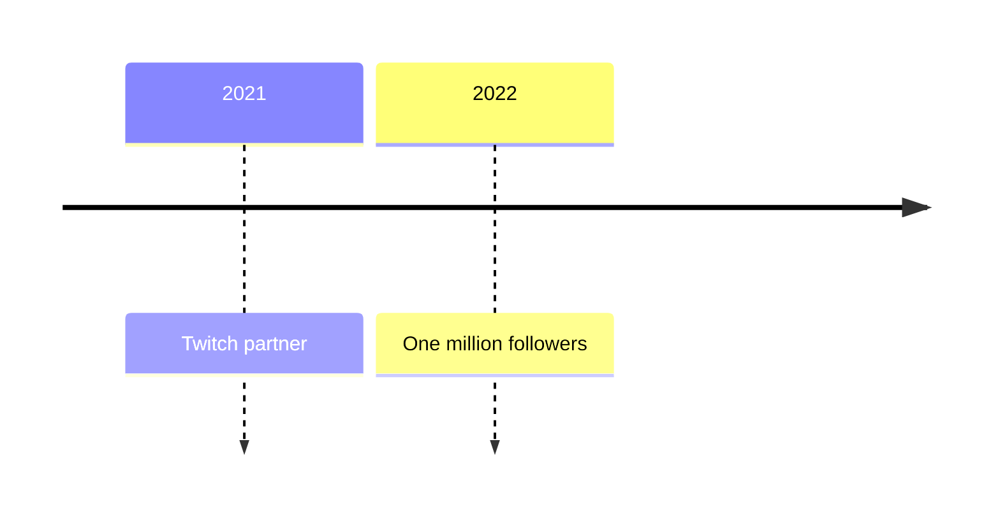
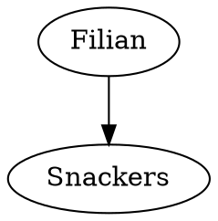

# Configuration

The engine reads its settings in layers. Each layer overrides the one
before it:

1. built-in defaults,
2. the configuration file, `config.toml` in the working directory or the
   file `--config` names,
3. an env file `--env-file` names, then `.env` in the working directory.
   Neither overrides a variable the process already has,
4. environment variables,
5. options on the command line.

```
naw --config /etc/naw/config.toml --env-file /etc/naw/naw.env \
    --limit category_levels=8 --limit page_bytes=8MiB serve
```

`naw limits` prints every limit with the value these layers give it.

## Limits

Every limit the engine applies to content and people is in one table. Each
has a default and a range; a value outside the range is moved to its
nearest end. Numbers may be written `5000`, `5_000`, `64k`, `20MiB` or
`2GiB`.

Set a limit in the `[limits]` section of the configuration file:

```toml
[limits]
category_levels = 8
page_bytes = "8MiB"   # or 8388608
```

as an environment variable, `NAW_LIMIT_` and the name in capitals:

```
NAW_LIMIT_CATEGORY_LEVELS=8
```

or on the command line with `--limit name=value`.

A wiki's admins can change most limits for their own wiki under Admin,
Wiki settings, Limits. The scope column says how:

- **wiki**: anywhere in the range.
- **lower**: only down from the install's value, since the server pays for
  more (page size, template work, uploads).
- **install**: only the install's configuration sets it.

| Limit | Default | Range | Scope | What it limits |
|---|---|---|---|---|
| `page_bytes` | 5 MiB | 64 KiB to 32 MiB | lower | Largest article text, in bytes |
| `page_title_chars` | 200 | 20 to 500 | wiki | Longest page title |
| `edit_summary_chars` | 200 | 20 to 1000 | wiki | Longest edit summary |
| `page_address_chars` | 100 | 20 to 200 | install | Longest page address |
| `category_levels` | 6 | 1 to 16 | wiki | Levels in a category name: `Streams/ARG/2024` is three |
| `category_key_chars` | 100 | 20 to 200 | wiki | Longest category address |
| `category_pages_shown` | 5000 | 100 to 50000 | lower | Pages one category page lists |
| `template_depth` | 16 | 2 to 64 | lower | Templates inside templates |
| `template_calls` | 2000 | 50 to 20000 | lower | Template and function calls in one page |
| `template_output_bytes` | 12 MiB | 1 MiB to 64 MiB | lower | Longest text a page may expand to |
| `templates_per_page` | 200 | 10 to 2000 | lower | Different templates one page may use |
| `template_uses_shown` | 50 | 10 to 1000 | wiki | Pages a template's page lists as using it |
| `recent_changes_shown` | 100 | 10 to 1000 | wiki | Edits Recent changes shows |
| `all_pages_shown` | 300 | 50 to 2000 | wiki | Titles on one screen of All pages |
| `system_list_shown` | 200 | 20 to 2000 | wiki | Rows on the other special pages |
| `files_shown` | 120 | 12 to 1000 | wiki | Files on one screen of the file lists |
| `history_per_page` | 50 | 10 to 500 | wiki | Revisions on one screen of a history |
| `search_results` | 25 | 5 to 200 | wiki | Results on one screen of search |
| `file_uses_shown` | 100 | 10 to 1000 | wiki | Pages a file's page lists as using it |
| `big_edit_bytes` | 500 | 50 to 100000 | wiki | An edit this big either way is shown in bold |
| `drafts_per_person` | 50 | 1 to 1000 | wiki | Drafts one person may keep on one wiki |
| `report_message_chars` | 4000 | 100 to 20000 | wiki | Longest report message |
| `report_burst` | 5 | 1 to 100 | wiki | Reports one person may send in a burst |
| `report_burst_minutes` | 10 | 1 to 1440 | wiki | How long a burst lasts |
| `reports_open_per_person` | 20 | 1 to 500 | wiki | Open reports one person may have |
| `uploads_per_day` | 300 | 1 to 100000 | lower | Uploads one person may make in a day, versions included |
| `upload_bytes_per_day` | 2 GiB | 16 MiB to 1024 GiB | lower | Bytes one person may upload in a day |
| `file_note_chars` | 300 | 20 to 2000 | wiki | Longest note on a file version or hiding reason |
| `rate_read_per_minute` | 600 | 60 to 100000 | install | Pages one address may open in a minute |
| `rate_heavy_per_minute` | 60 | 10 to 10000 | install | Searches, histories, diffs and old revisions one address may open in a minute |
| `rate_typing_per_minute` | 240 | 20 to 10000 | install | Previews, draft saves and suggestions one address may ask for in a minute |
| `rate_write_per_minute` | 30 | 5 to 10000 | install | Other forms one address may send in a minute |

The four `rate_` limits count per client address, and per /64 network for
IPv6, since one machine is usually given a whole /64. Each is a bucket that
holds a minute's worth and refills evenly, so a short burst passes and a steady
flood does not. A request over the limit gets a 429 page with `Retry-After`.
Static files, images, health checks and the Discord endpoint are not counted.
Behind a reverse proxy, turn `trust_proxy` on, or every reader shares the
proxy's address and one limit.

Bounds that keep the engine safe are not limits on purpose and cannot be
configured: the largest image dimensions, redirects followed when fetching
an image, the work a diff may do, and how long sign-in state lives.

## The worker and diagrams

A page may draw a diagram from a fenced block:

````markdown



````

`mermaid` takes any [mermaid](https://mermaid.js.org) diagram; `dot` (or
`graphviz`) takes a [Graphviz](https://graphviz.org) graph. The drawing is
made once, in the background, by the optional worker in `worker/`, and served
as an image, so it shows with JavaScript off. Each diagram is drawn twice, for
the light and the dark theme. Until its drawing is ready, and if it cannot be
drawn, the page shows the block's text; under a drawing the text stays one
click away.

The worker is a Bun process. It needs Chrome or Chromium for mermaid
(`CHROME_PATH` when it is not in a usual place) and nothing else for Graphviz.
It listens on `127.0.0.1:8081` by default (`WORKER_HOST`, `WORKER_PORT`) and
has no authentication, so keep it off the public network. Point the engine at
it with:

```toml
worker_url = "http://127.0.0.1:8081"
```

or `NAW_WORKER_URL`. Without it, diagrams stay as their text and nothing is
queued.

The same worker makes smaller copies of uploaded pictures. A JPEG, PNG or
WebP picture wider than 480 pixels gets a `srcset` of WebP copies at 480,
960 and 1600 pixels, so a phone loads a small file. A copy is made the first
time a browser asks for it; until then that request is sent to the original. The engine rebuilds every drawing from an allowlist of SVG elements
before storing it, and serves it with a policy that forbids scripts, so the
worker is never trusted with the reader's safety.
