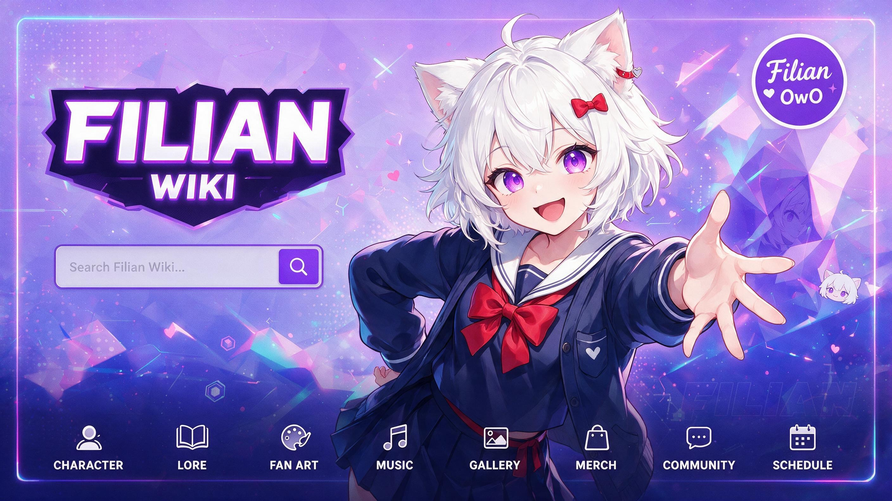

<div align="center">



# NotAnotherWiki Engine

**Вики-движок для фанатских комьюнити, который отказался быть плохим.**

Markdown вместо вики-разметки, настоящие скины, быстрая работа на Raspberry Pi,
чтение с выключенным JavaScript и лицензия, из которой нельзя сделать закрытый продукт.

*Кодовое имя: NotAnOtherVTUBERwiki. Первый запуск: SnackersWIKI, для Snackers,
комьюнити вокруг Filian.*

[English](../../README.md) | Русский

</div>

---

## Статус: пре-альфа

Ничего ещё не работает. Сейчас в репозитории лежат дизайн, схема БД и принятые решения.
Роадмап в [ROADMAP.md](../ROADMAP.md), а обоснование каждой технологии
в [STACK.md](../STACK.md).

Все версии в этом документе проверены по crates.io, npm и официальным релизам
на 30.08.2026, а не взяты из памяти.

<details>
<summary><b>Показать ASCII-арт</b> (он широкий, поэтому спрятан)</summary>

```text
             --@@-:::::::::..      @= -++-:@@@   .        @@                @:@:-
        ... ..  -*@@%++====+@-    @-.@@ :@::@@@@@@@@@@@@. .@ .    @       @@@*@#@    ..          ..
            ... -  -#%*=:-:::---@%@ @@@@*.=@ @@@@....-+@@@ @   @@@@@@@  %@@@:#%#@@-  .    .....
    . ... ... -@@+.  ----:::::. @@@ @*:@@. @@@.  .......:-.. @@@@#=-*%@@@@-:+@+--@@*  .  .... ...
 . . .. . .  -@:.- ...  ------*@@@ @@@@.@@@@+ .@@@@@@@@@@@@@@@  . :......@=:#=.@@@ @. . .  .  .....
   . .. . . -#@%@@=---     . .@+@@#@@%:@*@@..@@@@@      +@@@@@@@@@@@@@@#. @@.@@@@@ @. @ ...  ......
  .  .. . . -@::::::------.. :@- @@@ @@%@@ @@@@@@@@@@@=@@@@@@@ .- =.  %@@@..@.@*%@@@@@. .... ......
  .  .. .. --:::::::::::-- . .@*-@ %@@%#@#@@@@@@#=    .@@@@@@@@@. -@@@.%@@@ @-@*@@ @@@  .. ..  ....
   ....... ---------------... @@  @@@@#@@@@@@@:  .@@@@@@@@@@@@@@@@@* .=@@@@@ @@@*@@@@@ ............
   . ..     ...   ..      ..  @@.@@%%%@@%@@@@=@@@@@@@@@@@@@@@@@@@@@@@@  .@@@@.@.@=@+@. ............
   .. .:@@@:  ............... :@@@@%@#@@@@@@@@@@@@@@@@@@@@@@@@@@@@@@@@@@  @@%@@@%@ +@  ............
 ..... -%%@=  .    ..........  @@%%@%@@@@%@@@@@@@@@@@@@@@@@@@@@@@@@@@@@@@@@@@#@@ @.@. .. .....   ..
 ...  .     ...........       @@@@@%%@%@@%@%@@@@@@@@@@@@@@@@@@@@@@@@@@@@%@@@@+@@@=@@  .. ..........
      ...........  ..  @@@@@ @@%@@@%@%@@@%*@@@@#@@@@@@@@@@@@@@@@@@@@@@@@#@@@@+@@@.@   .............
   ..  . ......... .  @-:@@@:@%%@@@%@%@@@:*@@@:=@@@@@@@@@@@@@@@@@@@@@%@@@%@:@+@%@.@@  .............
     ..          ..  =---:::@@@@@@@%%@@@@=@@@:-=@@@@@@@@@@@@@@@@@@@@@@@-@@@ @+@%@@*@  .............
 ...  ..............  ----  @@@@@@%%%@@@-*@@-+%:@@@@@@@@@@@@@@@@@@@@#@@ %@@*@%@@%@:@-
       .           .       .@%@@@@#@@@@-@##:=@@-%@@@@#@@@@@@@@@@@@@#@@%-:@@@.@@%#@:@@@@@@. .     ..
 ..                ..  .  @:@%@@#%%@@@.@@#*@@@@#+@@@@@@@@@@@@@@@@@#@@@@--=@@.@@%%@=@@+@@:=  .......
            ....    ..   @@:@@@@*@@@=@%@%#*@@@@@@@@@@@#@@@@@@%@@@@%@@%@-+=-#@@@@%@-@@ ----= ..  ..
   ..  .         .....   @.@@@@@@@#=#@-@@@@@@@@%=-%@@@*@@@@@@%%@@@@@%@@@@@@*@ @@@#:@@ -:..  ..... .
     ..    .       .     @ @*+@@.-%@@@@@..@#..%@@@-.@@*#@%@@@@@#@@@#**@@=%-=@#.@@#*@@ :-   .. .....
    .      .    . ...    @.@*=#@@@@@@@@.       .@@@@@@@@%@@@@@@*#%@@@@@@@@@@@ @.@@@@@. .. ...    ..
 .      ..............  #@@@@@@@%%@@@@    ...:.   +@@@@@@@@@%%@@@@@@@@@*% @@=@ @ @@#@* ....   .....
 ........  ....... ..   @@.@%@@@%@%@@@.@@. ......==@@@@@@@@@@@@@          @@:@@@@*=@@#  .   ..  .
   ......... ..  ...   @@: @%%@@%@#@@@@:@@.... . @@@@@@@@@@@%@@@ ........   %@@@%@@#@.  ... ..  . .
 ............   ...   @@ #.@%@%%@@%@@ @-.%.==+#@@@@%@@@@@%@@@@@@=   . ..@@ .@@@@ =@@@.  ...... ....
              ...    @@@.#*@#@%%%@@@@@+@+---:::++*%%%@@@@#%%@%@@@@@@@+ @@ @@@@@@*#%@@   ..    .....
 .........  ...     @.%#=#**%%%%%@.@%@:--@-=***%%@@@@@@@%@@%%%@@%=:..==::@@@:@%+.@#@@    ..........
 .  ...   .. ...=  @.%%=.%%.#*%#@@.@#@@*%#*%@@@@@@@@%%%%%@@@@@@@@%*==-::@@-.@@@#@@%@@    .. .......
 ....  ..  ...   .@ @%#.@=@-@*##%@@+@%@:@@@@@@@@@@@@@@@@@@@@%@@%%@@@%%*=-: @@@@-@@@*%%    .........
   .....    .      @@@ @ +@%*%**%#@+@@@@+@@@@@%%%@%@%++*###%@@%@@@@@%@%@#+@@@ #%##*@.@    .. ......
 ...........   .:@@@:@ @@@ @%=@##%@@-@.%@@@@@@@@@@@@%%@@@@@%*%@@@%%@@@@:@@@@ @@%@%==.@@   ...... ..
 ............  .@@@@ @@@@  %@ @%+%@.%*@..@@+@@@@@%%%@@@%%%@@@@%%@@@@@ @@@ @.@%%@@ @#.@@@.  .... ...
            ..:+@@@=@@-:..%.@@ #-%%%.@@.@: #==@@@@@@@@@@%%%%@@@@@@%@@@..@.@@*+@@ @ .*@@ @  ........
 .............    ...@%.@++. @@.#--*@.@@ @% .:..-@@@@@@@@@@@@@@@@*: .. @%@@*%@@ @@ %..@        ....
 ................#@@@  @@*.@@ @. @@-:-+@@.@@*--::..:#@@@@@@@+.  -.:+@ @.**#@@..@@ @ @%%@.      ....
 ......    ......    .*@-..-. :@. +@@=::#.@@@===--::...  ....:@@--+...@@#%# :@@. @@ * @@@. ......
        :%      .. . :#. @*  . @@.:@@@@@:@#@  .=====------===@@ = .@*:.. @*.@ .#- @@@ . #@@.   ....
 @@@@@@@@@@@@:    .. . .:. ....@@  @@@@@@%@@      :========: @@ @@@@@@@@@@ @@.+:@  +@@@ .  ....
#@%*=-----=+@@@   ....   .... @ @  :@@@@@ :@                 @@.-..*@@@@@ +@  +@@@   .*@@.      :@*
:+===-----.@%@=@@ .....         @..- @@@@:. @               @@. .@@@@@@@ @@@%   .-  .       @@@@@@@=
:++=++=-=+:@#%-@*@    .%@@@@@@@@@@   @@@@                     ..@= @%@@.  #@@@@@@@@#=....=@@@=:%@*::
.---=++=+*@#%-@@-@@@@@@@@@@+@@       .@@@                    @.   .@*@@ . .    @@@@@@@@@@%=@+%*#@@#:
.------=*.  *@= @%%-==    @   @      .@@@                    @@@   @@@  @@@@@@#.       *==:+@@*.-@@=
.===#%%%@@@@* @@@@++@@@.   .@   @.   =# .                     @@.  @@*  :  -@@@@@@@@@@@#=+-*@@@@#:..
:#**# ..:%=:#@@%+*.@@=%@@.   .@  .@                            @:  :@  @.  @   .---.:::::-#-@-:-@@%.
.@@**@@:  -++-:.=. %*+*+%@@.   @@  :@   .                             @  .@   *@@#@%%@@@@@   +:+--=:
  .@@@%#%@@*+-+-=:=@##%**+@@@    @@  @-                             .@  #@   @%%*=**%@@@@@@@=+=++*+:
      @@-::=+*##**%@+=====*+@      @   @.                          :@  @@   @%==*-+*@@##**#@**@@@@@*
      .@@@@%#%%@@@*++=------#@      #@  .#     .:@@@@@@@@.        @-  @= . .@++==+#%%##**#%@@@@:
       @@@%++*=#%%*+--:.::-..@=       +#  +- ..:@@@.  .-@@%..##  @   @     ++-----+#%%#++#%@@
        @@@@*=::--=+======:.:-@         #.  +.               =..+  .#      @-:-::-=+**+*+#@@%      .
.       .#%%#=:+*++++=::.:..+.-@          #                   .   #.       *.--=+=**===*#@@@       .
.          ...              ....            .                   ..         .          .....        .

```
*Сгенерированный арт, лежит просто чтобы в репозитории было не скучно.
См. [AI-ASSETS.md](../../AI-ASSETS.md).*

</details>

---

## Зачем это нужно

Фанатские вики это самая волонтёрская и при этом самая плохо обслуживаемая категория
софта в интернете. Текущие игроки выжимают ценность из волонтёров и почти ничего не
дают взамен.

| Что болит сейчас                        | Как делаем мы                                                          |
|-----------------------------------------|------------------------------------------------------------------------|
| Реклама, трекеры, раздутые страницы     | Ноль рекламы, ноль трекеров, всё на донатах                            |
| Медленные страницы, TTFB 3-8 секунд     | Рендер по записи, отдача из кеша. Меньше 20 мс p50 при попадании       |
| Закрытая экосистема вендора             | Self-hosted, данные экспортируются в открытом формате и ваши навсегда  |
| Жёсткая разметка MediaWiki              | Markdown плюс настоящая трансклюзия и неймспейсы                       |
| Шаблоны правятся только через деплой    | Страницы `Template:` лежат в БД и правятся в браузере                  |
| Виджет это PHP и деплой                 | Компоненты `Module:` на TypeScript или Vue SFC, сборка на сервере      |
| Всё ломается без JavaScript             | Чтение и редактирование работают с выключенным JavaScript              |
| Слабое API                              | REST, GraphQL, вебхуки, SSE плюс совместимость с API MediaWiki         |
| Миграция это тупик                      | Импорт из wikitext и открытый экспорт с первого дня                    |

---

## Архитектура одной картинкой

                     читатели (почти весь трафик)
                                |
                   [ Caddy / CDN: Brotli, HTTP/3 ]
                                |
                 +--------------+--------------+
                 |                             |
      [ naw-web: N реплик ]          [ worker: M реплик ]
        Rust, Axum, stateless          Bun 1.4.0, async
        кешированный HTML и API        сборка, SSR, схемы
                 |                             |
                 +------+---------+------------+
                        |         |
               [ PostgreSQL 18 ] [ Valkey 9 ]
                                       |
                        [ объектное хранилище: диск или S3 ]

Самое важное решение в проекте: **рендер по записи, отдача при чтении**.

Запрос читателя никогда не парсит Markdown, не рендерит шаблон и не трогает воркер.
Он ищет `render_cache` по хешу контента и отдаёт результат. Промах кеша рендерит
страницу асинхронно в фоне, а читатель продолжает получать предыдущую, полностью
валидную версию.

Каждый слой масштабируется отдельно. Нет установленного Bun-воркера? Чтение не
страдает вообще, просто нельзя публиковать новые компоненты и рендерить новые схемы.

---

## Стек

| Слой                | Выбор                                       |
|---------------------|---------------------------------------------|
| Язык                | Rust, edition 2024, rustc 1.98.0            |
| HTTP                | Axum 0.8.9                                  |
| База данных         | PostgreSQL 18                               |
| Драйвер             | SQLx 0.9.0, проверка SQL на этапе сборки    |
| Кеш и очереди       | Valkey 9.1.1                                |
| Шаблоны             | MiniJinja 2.24.0                            |
| Markdown            | pulldown-cmark 0.13.4, ammonia 4.1.4        |
| Интерфейсы авторства| Vue 3.5.42 плюс Vite 8.2.2                  |
| Воркер              | Bun 1.4.0 (на Rust), опционально            |
| Бандлер             | rolldown 1.2.6                              |
| Поиск               | Сначала Postgres FTS, Meilisearch опционально |
| Хранилище           | Сначала локальный диск, S3 через object_store |

Полное обоснование, включая почему Bun не на пути запроса, в
[STACK.md](../STACK.md).

---

## Быстрый старт

Требования: Rust 1.98 (edition 2024), Docker с compose, Bun 1.4.2 или новее, sqlx-cli.

```bash
git clone https://github.com/Vadim-Khristenko/NotAnOtherVTUBERwiki.git
cd NotAnOtherVTUBERwiki

# 1. Запустить PostgreSQL 18 и Valkey 9 на портах 5433 и 6380
docker compose up -d postgres valkey

# 2. Настроить окружение
cp .env.example .env

# 3. Накатить схему
cargo install sqlx-cli --version 0.9.0 --no-default-features --features postgres,rustls
cargo sqlx migrate run

# 4. Запустить движок
cargo run -p naw-cli -- serve
# состояние системы: http://127.0.0.1:8080/health, готовность: /ready

# 5. При желании собрать UI редактора
cd ui && bun install && bun run build
```

Веб-слой отдает читателям кешированный HTML; рендер происходит при записи.
Воркер в `worker/` опционален и никогда не находится на пути запроса на чтение.
---

## Структура репозитория

| Путь                | Что там                                             |
|---------------------|-----------------------------------------------------|
| `docs/ru/ROADMAP.md` | Что и в каком порядке мы строим. Начинать отсюда.  |
| `docs/ru/STACK.md`   | Почему выбрана каждая технология.                   |
| `docs/`              | Роадмап, стек, результаты бенчей.                   |
| `.github/AI-POLICY.md`    | ИИ использовать можно, но вы должны уметь объяснить свои изменения |
| `docs/ru/AI-ASSETS.md`    | Арт, ИИ-генерация и условия отправки                |
| `.github/assets/`   | Арт проекта, см. [AI-ASSETS.md](../../AI-ASSETS.md).|
| `naw-core`          | Домен, сервисы, БД. (ещё не создано)                |
| `naw-web`           | Axum, роуты, middleware, API. (ещё не создано)      |
| `naw-markdown`      | Пайплайн рендера. (ещё не создано)                  |
| `naw-cli`           | Админка, миграции, импорт. (ещё не создано)         |
| `ui/`               | Приложение авторства на Vue 3. (ещё не создано)     |
| `worker/`           | Сервис на Bun. (ещё не создано)                     |

---

## Лицензия простыми словами

| Что                             | Условия                                                                |
|---------------------------------|------------------------------------------------------------------------|
| Движок                          | AGPL-3.0 или новее. Изменил и отдал по сети, опубликуй исходники.       |
| Скины, темы, плагины            | Можно лицензировать как угодно, включая коммерчески, по исключению.     |
| Документация                    | CC BY-SA 4.0.                                                          |
| Имя и логотип                   | Не лицензируются. См. [TRADEMARK.md](../../TRADEMARK.md).                     |

Из этого нельзя сделать закрытый коммерческий продукт, потому что любой, кто
взаимодействует с изменённой копией по сети, имеет право на полные исходники. При
этом продавать скины, темы и плагины может каждый.

- [LICENSE](../../LICENSE) - AGPL-3.0
- [LICENSE-EXCEPTION](../LICENSE-EXCEPTION) - исключение для скинов, шаблонов и плагинов
- [LICENSE-DOCS](../LICENSE-DOCS) - CC BY-SA 4.0
- [NOTICE](../../NOTICE) - авторство, обязательно сохранять
- [TRADEMARK.md](../../TRADEMARK.md) - политика имени и логотипа

---

## Как участвовать

Сначала [CONTRIBUTING.md](../../.github/CONTRIBUTING.md), а перед тем как с кем-то говорить,
[CODE_OF_CONDUCT.md](../../.github/CODE_OF_CONDUCT.md).

Коротко:

- Начинайте с ишью. Крупные изменения требуют обсуждения дизайна, проект пока в основном
  про дизайн.
- Conventional Commits, ветки `feat/vai/что-то`, одно логическое изменение на ветку.
- Перед пушем: `cargo fmt`, `cargo clippy`, `cargo test`.
- SQL только через `sqlx::query!`. CI собирается с `SQLX_OFFLINE=true`.
- Без em-dash в коде, комментариях, коммитах и документации. Таков стиль проекта.
- Прочитайте [кодекс поведения](CODE_OF_CONDUCT.md). Он короткий и действует везде.

Арт тоже приветствуется. Условия в [AI-ASSETS.md](../../AI-ASSETS.md): коротко,
вы даёте проекту безотзывное бессрочное право использовать работу и гарантируете,
что она ваша.

**ИИ-инструменты использовать можно и это приветствуется**, в коде тоже. См.
[AI-POLICY.md](../../.github/AI-POLICY.md). Мы не требуем этого и не запрещаем. Единственный
настоящий тест: вы можете объяснить изменение, которое отправляете.

### Переводы

У каждого английского документа есть русская версия в `docs/ru/` с тем же именем. Оба языка равноправны: если вы меняете документ, напишите в пулл-реквесте,
нужно ли то же изменение второму языку, или откройте отдельное ишью. Устаревший перевод
хуже, чем его отсутствие, поэтому скажите, если не можете его поддерживать.

| Английский             | Русский                        |
|------------------------|--------------------------------|
| `README.md`            | `docs/ru/README.md`           |
| `.github/CONTRIBUTING.md` | `docs/ru/CONTRIBUTING.md`   |
| `.github/CODE_OF_CONDUCT.md` | `docs/ru/CODE_OF_CONDUCT.md` |
| `.github/SECURITY.md`    | `docs/ru/SECURITY.md`       |
| `.github/AI-POLICY.md`    | `docs/ru/AI-POLICY.md`      |
| `AI-ASSETS.md`         | `docs/ru/AI-ASSETS.md`              |
| `docs/STACK.md`        | `docs/ru/STACK.md`             |
| `docs/ROADMAP.md`      | `docs/ru/ROADMAP.md`           |

### Язык

Это русскоязычный проект по сути. Автор и значительная часть комьюнити пишут по-русски,
поэтому у каждого документа есть версия на обоих языках, и русский для нас полноценный
рабочий язык.

Для ишью и пулл-реквестов лучше использовать английский. Русский всегда приветствуется, и
мы никогда не закроем что-то за то, что оно написано на нём, но английский держит трекер и
ветки ревью читаемыми для всех, кто потенциально может помочь, включая тех, кто не говорит
по-русски.

Если вам тяжело писать по-английски, пишите по-русски. Понятный репорт на русском
гораздо полезнее непонятного на английском, и при необходимости мы переведём его прямо в
обсуждении.

---

## Про Snackers

Проект начался внутри Snackers, комьюнити вокруг Filian. Первая вика на нём это
SnackersWIKI. Отсылки к комьюнити разбросаны по коду, потому что они безвредные и
потому что нам так нравится. Они ни на что не влияют, и движок ни разу не заточен
под одного VTuber.

Filian и Snackers не связаны с проектом и его не одобряли. Если это когда-нибудь
понадобится изменить, мы изменим.

---

<div align="center">

Сделано фанатами для фанатов. Лицензия следит, чтобы так и осталось.

[English version](../../README.md)

</div>
